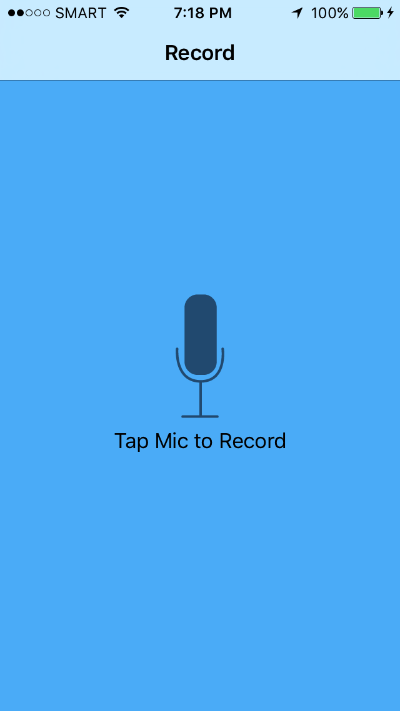
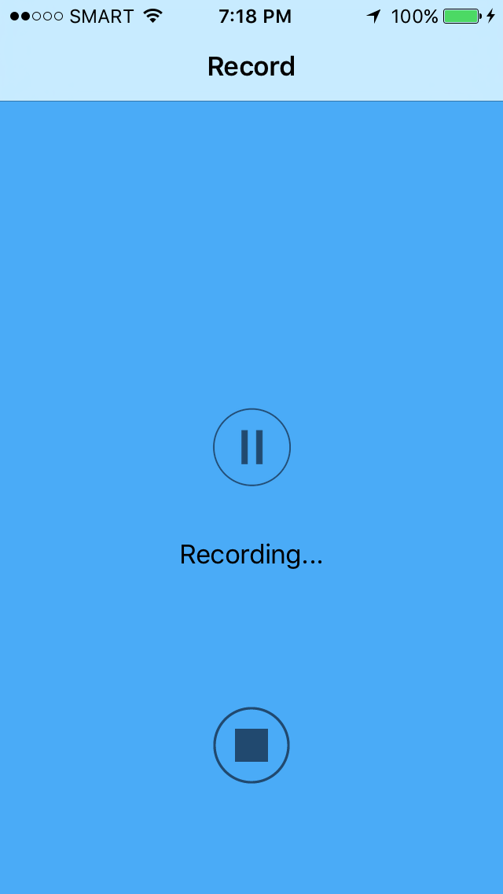
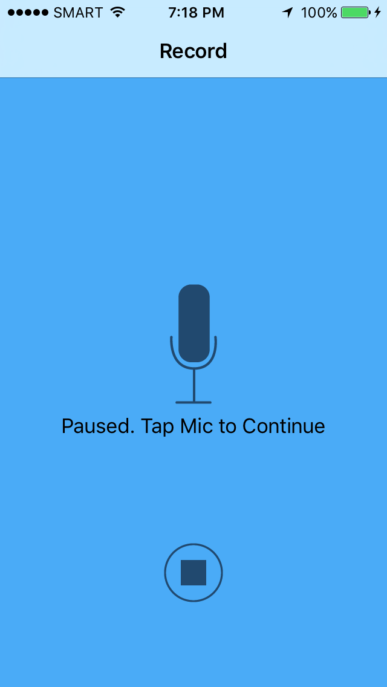

# Pitch Perfect 

Udacity project: records voice and plays it back. Can add the following effects during playback of the recorded audio. 

* Slow

* Fast

* Chipmunk

* Darth Vader

* Echo

* Reverb

## Screenshots

## Author
Jovito Royeca, http://jovitoroyeca.com
